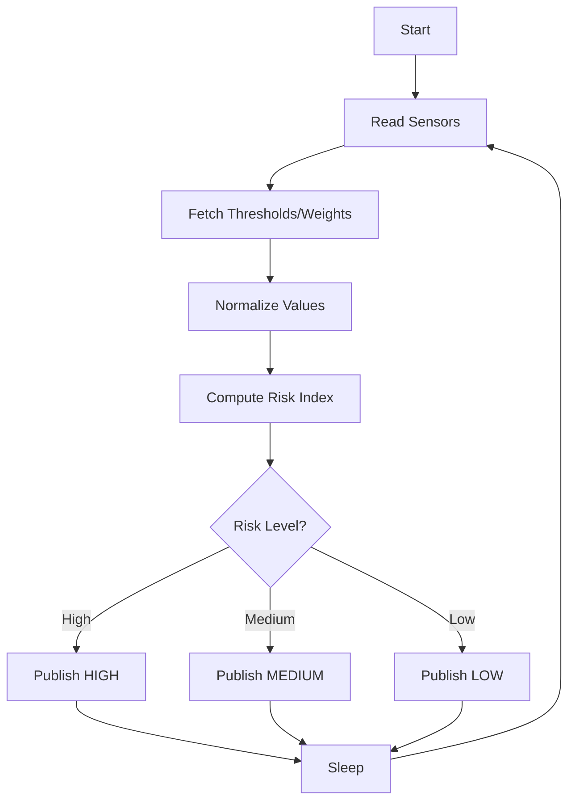

# Landslide Prediction Logic

## Inputs
- Soil moisture (analog)
- Rainfall intensity (analog)

## Risk Index (weighted)
Each sensor contributes a normalized score (0..100). A weighted sum produces the risk index.

```
score = wS * soilScore + wR * rainScore
```

### Normalization (example)
```
soilScore = map(soilADC, soilMin, soilMax, 0, 100)
rainScore = map(rainADC, rainMin, rainMax, 0, 100)
```

### Risk Levels
- Low:    score < lowThreshold
- Medium: lowThreshold <= score < highThreshold
- High:   score >= highThreshold

## Pseudocode
```
loop:
  read soil ADC
  read rain ADC

  fetch thresholds + weights from Firebase (cached, refresh periodically)

  normalize sensor values -> scores
  riskIndex = wS*soilScore + wR*rainScore

  if riskIndex >= highThreshold: riskLevel = HIGH
  else if riskIndex >= lowThreshold: riskLevel = MEDIUM
  else riskLevel = LOW

  write sensor values + riskLevel to Firebase
  sleep
```

## Flowchart (Mermaid)

