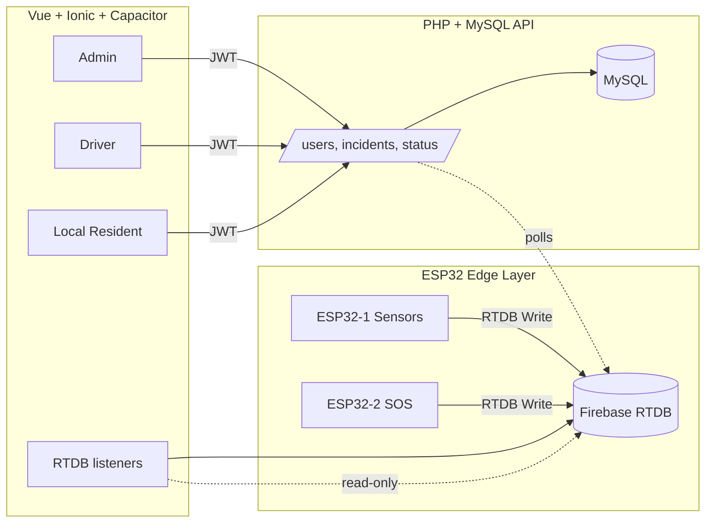

# System Architecture (highway gbbs)

## Data flow
1. ESP32 sensor node writes `/live/sensor`; SOS node writes `/alerts/sos`.
2. Web/mobile app listens to RTDB for live sensor + SOS only.
3. Users authenticate against PHP API (JWT). Roles and accounts live in MySQL.
4. Incident reports (with base64 images) post to `/api/incidents`.
5. `/api/status` computes highway status from MySQL incidents + RTDB sensor risk + SOS; admin override persists in `highway_status`.
6. Local notifications fire on SOS or high/closed incidents.

## Deployment
- cPanel-friendly PHP 8 + MySQL hosting for `/api`.
- RTDB used only for ESP32 writes and app reads (`live/sensor`, `alerts/sos`).
- Vue/Ionic app served from any CDN or via Capacitor Android bundle.
 
